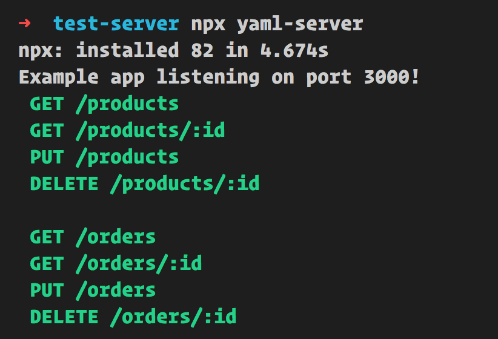

[](https://dev.azure.com/devrel/chris-testing/_build/latest?definitionId=23&branchName=master)

[](https://www.npmjs.com/package/yaml-server)
[](https://www.npmjs.com/package/yaml-server)
[](http://opensource.org/licenses/MIT)

## Table of Contents

- [About](#about)
- [Features](#features)
- [Install](#install)
- [Run](#run)
- [Routes](#routes)

## About

Recognition, this project wouldn't be here with out the great `json-server`. I thought to myself that JSON was a little verbose. So I created `yaml-server` so you can have a Mock REST API based on a YAML file instead.

`yaml-server` is a command line tool that create a REST server based on a YAML file.



## Features

- **RESTful API** Do HTTP requests towards a Mock API using GET, PUT, POST and DELETE created off of a `db.yml` file.
- Filter your GET calls with query parameters `page` and `pageSize`, example:

    ```bash
    /products?page=1&pageSize=10
    ```

- **Create new resource**, make a POST call with the following format `/<new resource>/new`, example:

    ```bash
    /kittens/new
    ```

    Ensure you have a payload as well, looking like for example `{ title: 'paw paw' }`

- **Sorting, by order and key**, you can sort a resource response using query parameters `sortOrder` and `sortKey`. Assume we have the resource `/kittens` where one kitten object looks like so `{ id: 1, name: 'paws' }` and the entire resource looks like so:

    ```javascript
    [{
      id: 1,
      name: 'paws'
    }, {
      id: 2,
      name: 'alpha paw'
    }]
    ```

    Use sorting by appending `sortOrder` and `sortKey` like below:

    ```bash
    /kittens?sortOrder=ASC&sortKey=name
    ```

    This would give the response:

    ```javascript
    [{
      id: 2,
      name: 'alpha paw'
    }, {
      id: 1,
      name: 'paws'
    }]
    ```

## Install

Either install it globally with:

```bash
npm install -g yaml-server
```

OR use `NPX`

```bash
npx yaml-server --port 3000 --database ./db.yml
```

## Run

1. Create a `db.yml`.
1. Give `db.yml` an example content, for example:

   ```yaml
   products:
     - id: 1
       name: tomato
     - id: 2
       name: lettuce
   orders:
    - id: 1
      name: order1
    - id: 2
      name: order2
   ```

1. There are two ways to start:
   1. **Quick start**, run `npx yaml-server`, this will start a server on `http://localhost:3000` and base it off a `db.yml` at the project root that you created.
   1. **With parameters**, You can also configure like so `npx yaml-server --port 8000 --database ./db/mydb.yml` (If you place db file under `./db/mydb.yml`)

### See your routes

Open up a browser and navigate to `http://localhost:<your port>`. Default port is `3000`, if you specified port use that as port instead.

The default page at route `http://localhost:<port>` will tell you what routes and operations are available. Here's a typical response for the default page:

```output
Welcome to YAML Server

Routes available are:

 GET /products
 GET /products/:id
 PUT /products
 DELETE /products/:id

 GET /orders
 GET /orders/:id
 PUT /orders
 DELETE /orders/:id
```

## Routes

Routes are created from a YAML file. The default value is  `db.yml`. You can name it whatever you want though.

Routes are first level elements. Consider the following example file:

```yml
# db.yml
products:
  - id: 1
    name: tomato
  - id: 2
    name: lettuce
orders:
  - id: 1
    name: order1
  - id: 2
    name: order2
```

This will produce routes `/products`, `/orders`. Below is a table of supported operations with `products` as example resource. The same operations are also supports for `orders/`.

| VERB     |Route          | Input      | Output             |
|----------|---------------|------------|--------------------|
| GET      | /products     | *None*     | **Array**          |
| GET      | /products/:id |  **e.g 3** | **Object**         |
| POST     | /products     | **object** | **Created object** |
| PUT      | /products     | **object** | **Updated object** |
| DELETE   | /products/:id | **e.g 3**  | **Deleted object** |
